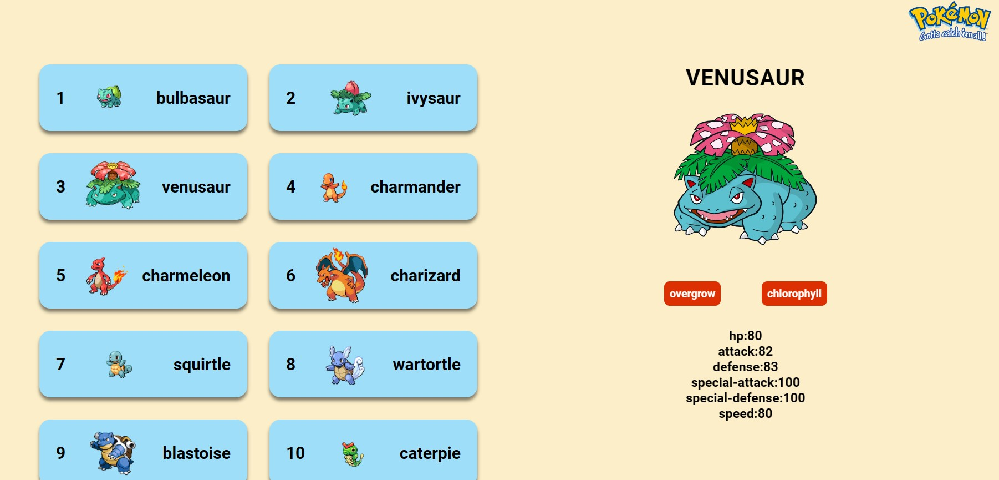
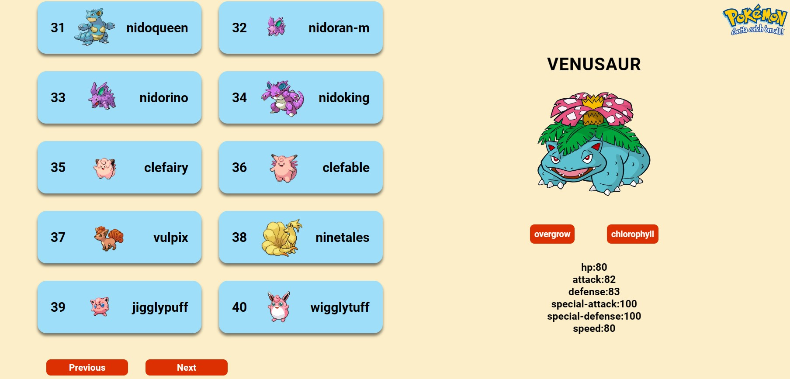

# Getting Started with Create React App

This project was bootstrapped with [Create React App](https://github.com/facebook/create-react-app).

## WebApp Functionalities

- The App consists of two main parts, a **left-sided panel** that displays the list of pokemon's and a **right-sided panel** that shows details
  of the pokemon upon clicking.

  

- The App also contains two buttons **Next** and **Previous** to toggle to other pages

  
